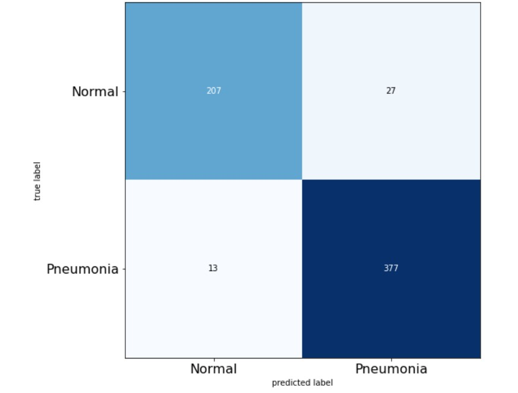

The goal of this notebook is to offer a general pipeline for dealing with computer vision classification tasks. I utilize transfer learning, fine-tuning, cyclical fit, and learning rate finder methods to increase the accuracy of the network.

### Dataset and Sampling:
Dataset is an imbalanced set of pictures of cases with pneumonia and normal ones. The number of pneumonia cases is almost 3 times the normal cases. I tried the under-sampling method and reduced the number of pneumonia cases, while the training became faster it appears the final accuracy on the test set is still a decent one. I also tried the augmentation method for oversampling the normal cases, the result was not much different from under-sampling the other class. (the splitting of test and validation sets are a bit questionable because the test set is 600+ images and the validation set includes only 16 pictures, however, I did not change the split since the split had come from the owner of the dataset)
You can find the dataset here: 
https://www.kaggle.com/paultimothymooney/chest-xray-pneumonia

### Model and Training:
The model is a pre-trained DenseNet121 with 7m parameters, the last layer of it is dropped and instead, the is a GlobalAveragePooling layer with a new dense layer with softmax activation. For the first round of the training, I keep the DenseNet frozen and only trained added the last dense layer. Though in the second I unfreeze the whole model and trained it on small learning rates. 
The training is done with the method introduced by Leslie N. Smith, we use the learning rate finder to find good ranges for learning rate and use cyclical training to lower and higher the learning rate in the range. The Keras implementations of LearningRateFinder and Cyclical fit are provided by https://www.pyimagesearch.com/

### Results:
The model reaches the Recall of 0.97, Precision of 0.93, and F1 accuracy of 0.95 on the test set. The heat map prediction from the model is depicted below:

  

